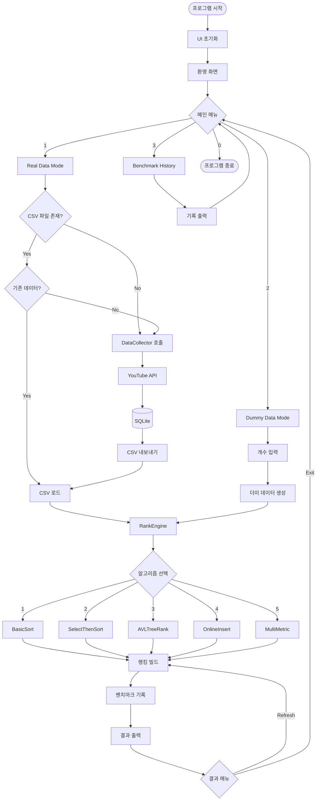
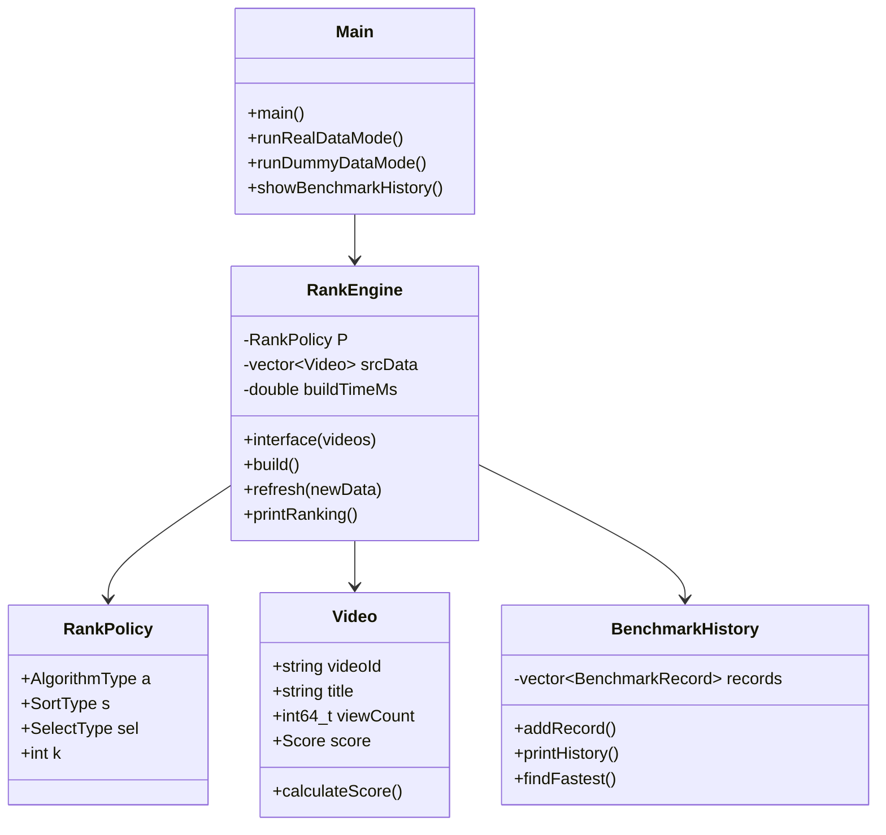
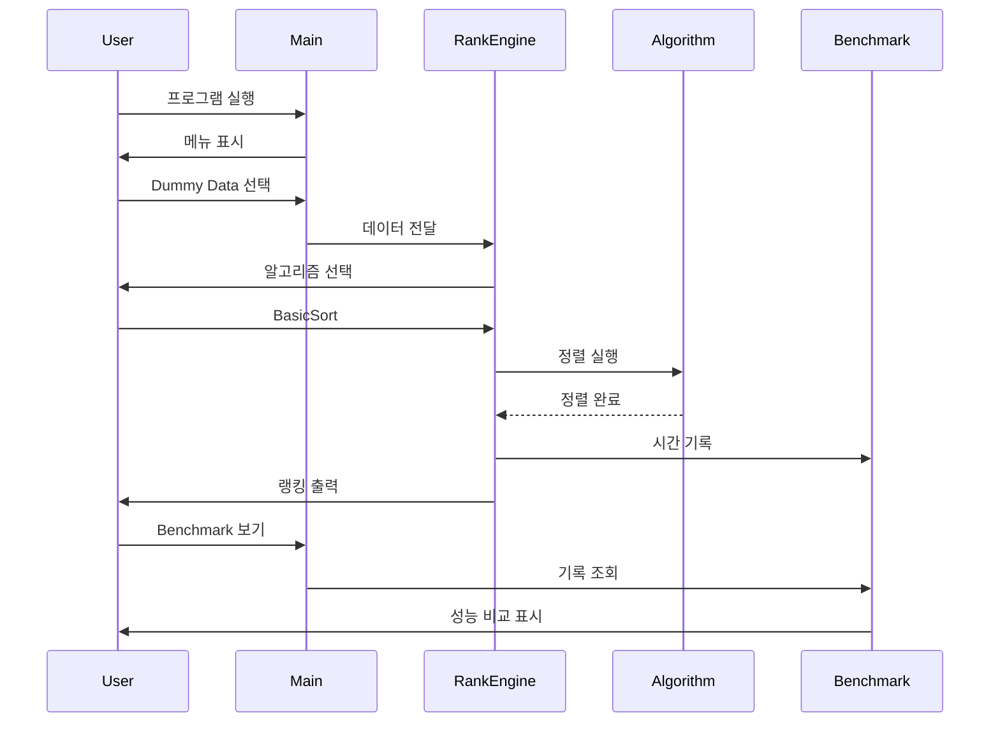
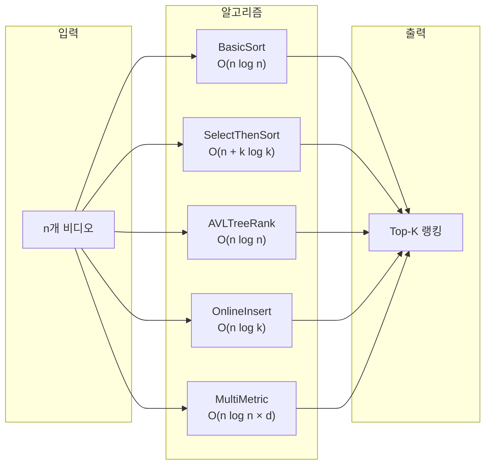

# YouTube Ranking System - UML Diagrams

## 1. 전체 실행 흐름 (Flowchart)

```mermaid
flowchart TD
    START([프로그램 시작]) --> INIT[UI 초기화]
    INIT --> WELCOME[환영 화면]
    WELCOME --> MENU{메인 메뉴}
    
    MENU -->|1| REAL[Real Data Mode]
    MENU -->|2| DUMMY[Dummy Data Mode]
    MENU -->|3| BENCH[Benchmark History]
    MENU -->|0| EXIT([프로그램 종료])
    
    REAL --> CSV_CHECK{CSV 파일 존재?}
    CSV_CHECK -->|Yes| USE_EXIST{기존 데이터?}
    CSV_CHECK -->|No| FETCH_API[DataCollector 호출]
    USE_EXIST -->|Yes| LOAD_CSV[CSV 로드]
    USE_EXIST -->|No| FETCH_API
    FETCH_API --> API_CALL[YouTube API]
    API_CALL --> SAVE_DB[(SQLite)]
    SAVE_DB --> EXPORT_CSV[CSV 내보내기]
    EXPORT_CSV --> LOAD_CSV
    LOAD_CSV --> RANK_ENGINE
    
    DUMMY --> GEN_COUNT[개수 입력]
    GEN_COUNT --> GEN_DATA[더미 데이터 생성]
    GEN_DATA --> RANK_ENGINE
    
    RANK_ENGINE[RankEngine] --> SELECT_ALGO{알고리즘 선택}
    SELECT_ALGO -->|1| BASIC[BasicSort]
    SELECT_ALGO -->|2| SELECT_SORT[SelectThenSort]
    SELECT_ALGO -->|3| AVL[AVLTreeRank]
    SELECT_ALGO -->|4| ONLINE[OnlineInsert]
    SELECT_ALGO -->|5| MULTI[MultiMetric]
    
    BASIC --> BUILD
    SELECT_SORT --> BUILD
    AVL --> BUILD
    ONLINE --> BUILD
    MULTI --> BUILD
    
    BUILD[랭킹 빌드] --> RECORD[벤치마크 기록]
    RECORD --> PRINT[결과 출력]
    PRINT --> RESULT{결과 메뉴}
    
    RESULT -->|Refresh| BUILD
    RESULT -->|Exit| MENU
    
    BENCH --> SHOW_HIST[기록 출력]
    SHOW_HIST --> MENU
```

## 2. 클래스 다이어그램

```mermaid
classDiagram
    class Main {
        +main()
        +runRealDataMode()
        +runDummyDataMode()
        +showBenchmarkHistory()
    }
    
    class RankEngine {
        -RankPolicy P
        -vector~Video~ srcData
        -double buildTimeMs
        +interface(videos)
        +build()
        +refresh(newData)
        +printRanking()
    }
    
    class RankPolicy {
        +AlgorithmType a
        +SortType s
        +SelectType sel
        +int k
    }
    
    class BenchmarkHistory {
        -vector~BenchmarkRecord~ records
        +addRecord()
        +printHistory()
        +findFastest()
    }
    
    class Video {
        +string videoId
        +string title
        +int64_t viewCount
        +Score score
        +calculateScore()
    }
    
    Main --> RankEngine
    RankEngine --> RankPolicy
    RankEngine --> Video
    RankEngine --> BenchmarkHistory
```

## 3. 시퀀스 다이어그램

```mermaid
sequenceDiagram
    participant User
    participant Main
    participant RankEngine
    participant Algorithm
    participant Benchmark

    User->>Main: 프로그램 실행
    Main->>User: 메뉴 표시
    User->>Main: Dummy Data 선택
    
    Main->>RankEngine: 데이터 전달
    RankEngine->>User: 알고리즘 선택
    User->>RankEngine: BasicSort
    
    RankEngine->>Algorithm: 정렬 실행
    Algorithm-->>RankEngine: 정렬 완료
    
    RankEngine->>Benchmark: 시간 기록
    RankEngine->>User: 랭킹 출력
    
    User->>Main: Benchmark 보기
    Main->>Benchmark: 기록 조회
    Benchmark->>User: 성능 비교 표시
```

## 4. 5가지 알고리즘 비교

```mermaid
flowchart LR
    subgraph INPUT[입력]
        DATA[n개 비디오]
    end
    
    subgraph ALG[알고리즘]
        A1["BasicSort<br/>O(n log n)"]
        A2["SelectThenSort<br/>O(n + k log k)"]
        A3["AVLTreeRank<br/>O(n log n)"]
        A4["OnlineInsert<br/>O(n log k)"]
        A5["MultiMetric<br/>O(n log n × d)"]
    end
    
    subgraph OUTPUT[출력]
        RANK[Top-K 랭킹]
    end
    
    DATA --> A1 --> RANK
    DATA --> A2 --> RANK
    DATA --> A3 --> RANK
    DATA --> A4 --> RANK
    DATA --> A5 --> RANK
```

